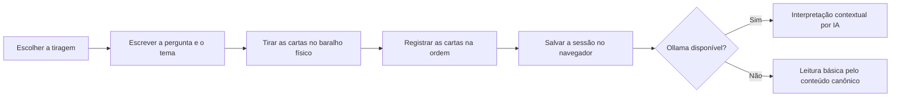

# Limiar — Tarô de Waite

Portal informativo e interativo em português brasileiro para estudar as 78 cartas do Rider-Waite e interpretar tiragens feitas com um baralho físico.

O Limiar não embaralha nem sorteia cartas. A pessoa realiza a tiragem com o próprio baralho, registra no site a sequência obtida e recebe uma leitura baseada no conteúdo canônico do projeto. Quando o Ollama está disponível, a aplicação também produz uma interpretação contextual por IA; se o serviço falhar, a leitura básica continua acessível.

> As interpretações têm finalidade simbólica e reflexiva. Elas não substituem orientação médica, psicológica, jurídica ou financeira.

## Recursos

- biblioteca pesquisável com os 22 Arcanos Maiores e 56 Arcanos Menores;
- significados por contexto: geral, carreira, amor e tendências futuras;
- páginas individuais com simbolismo, palavras-chave e referência ao manual;
- oito modalidades de tiragem, de uma carta à Mandala Astrológica;
- registro guiado das cartas retiradas de um baralho físico;
- interpretação contextual opcional com Ollama e o modelo `gemma3:12b`;
- leitura básica automática quando a IA local não está disponível;
- histórico de até 50 tiragens salvo no navegador;
- interface responsiva, animações e respeito à preferência de movimento reduzido;
- testes unitários, de componentes, de conteúdo e ponta a ponta.

## Tecnologias

| Área | Tecnologia |
| --- | --- |
| Aplicação | Next.js 16, React 19 e TypeScript |
| Estilos | Tailwind CSS 4 e CSS global |
| Animações | Motion |
| Validação | Zod |
| IA local | Ollama (`gemma3:12b`) |
| Testes | Vitest, Testing Library e Playwright |
| Conteúdo | Python, pypdf e Pillow |
| Gerenciador de pacotes | pnpm |

## Como a leitura funciona



A API valida a pergunta, a modalidade, a quantidade de cartas e a posição de cada uma antes de consultar o Ollama. A resposta do modelo também passa por um schema estrito e não pode introduzir cartas ausentes na tiragem.

## Pré-requisitos

Para executar a aplicação:

- [Node.js](https://nodejs.org/) 20.9 ou superior;
- [pnpm](https://pnpm.io/) compatível com o seu Node.js.

Para usar a interpretação por IA:

- [Ollama](https://ollama.com/) instalado e em execução;
- modelo `gemma3:12b` baixado localmente.

Para regenerar o conteúdo a partir do PDF:

- Python 3.11 ou superior;
- pacotes `pypdf` e `Pillow`.

## Instalação fácil no Windows (recomendado para iniciantes)

1. Instale o [Node.js na versão LTS](https://nodejs.org/), caso ainda não o tenha.
2. Baixe ou extraia a pasta completa do projeto.
3. Dê dois cliques em **`INSTALAR_E_INICIAR.bat`**.
4. Mantenha a janela preta aberta enquanto estiver usando o portal.

O assistente confere a versão do Node.js, prepara o gerenciador `pnpm`, baixa as dependências, cria o `.env.local` sem substituir uma configuração existente e inicia o servidor. Ao final, a janela permanece aberta com as instruções de acesso e o endereço [http://localhost:3000](http://localhost:3000), que também é aberto automaticamente no navegador. Na primeira execução, ele precisa de internet e pode levar alguns minutos.

Depois da primeira instalação, use o mesmo arquivo sempre que quiser abrir o Limiar. Para desligar o servidor, volte à janela do assistente e pressione `Ctrl+C`.

> O Ollama é opcional e não é instalado pelo assistente. Sem ele, todo o portal e a leitura básica continuam funcionando normalmente. Consulte [Interpretação local com Ollama](#interpretação-local-com-ollama) para ativar os recursos de IA.

## Instalação manual

No PowerShell, a partir da raiz do projeto:

```powershell
pnpm install
Copy-Item .env.example .env.local
pnpm dev
```

Acesse [http://localhost:3000](http://localhost:3000).

O conteúdo, as imagens e a leitura básica já estão no repositório. Portanto, o Ollama e o Python não são necessários para simplesmente navegar pelo portal.

## Interpretação local com Ollama

Baixe o modelo usado pela aplicação:

```powershell
ollama pull gemma3:12b
```

Inicie o Ollama, caso ele ainda não esteja rodando, e depois execute o projeto:

```powershell
ollama serve
pnpm dev
```

Por padrão, o servidor Next.js consulta `http://127.0.0.1:11434`. A geração pode levar alguns minutos dependendo de CPU, GPU, memória disponível e quantidade de cartas. O limite padrão é de seis minutos.

Se o modelo ou o serviço não estiver disponível, o resultado mostra a leitura básica e oferece a opção de tentar a interpretação novamente.

## Variáveis de ambiente

Crie `.env.local` a partir de `.env.example`:

| Variável | Obrigatória | Padrão/finalidade |
| --- | --- | --- |
| `NEXT_PUBLIC_SITE_URL` | Recomendada | URL canônica usada em metadados, sitemap e compartilhamento. |
| `OLLAMA_BASE_URL` | Não | Endereço do Ollama. Padrão: `http://127.0.0.1:11434`. |
| `OLLAMA_TIMEOUT_MS` | Não | Tempo máximo da interpretação em milissegundos. Padrão: `360000`. |

Exemplo:

```dotenv
NEXT_PUBLIC_SITE_URL=http://localhost:3000
OLLAMA_BASE_URL=http://127.0.0.1:11434
OLLAMA_TIMEOUT_MS=360000
```

Nunca versione `.env.local` ou credenciais. O `.gitignore` mantém apenas `.env.example` no controle de versão.

## Comandos disponíveis

| Comando | Descrição |
| --- | --- |
| `pnpm dev` | Inicia o servidor de desenvolvimento. |
| `pnpm build` | Gera o build de produção e valida a compilação. |
| `pnpm start` | Executa localmente um build já gerado. |
| `pnpm lint` | Analisa o código com ESLint. |
| `pnpm test` | Executa os testes Vitest uma vez. |
| `pnpm test:watch` | Executa o Vitest em modo interativo. |
| `pnpm test:e2e` | Executa os testes Playwright em desktop e mobile. |
| `pnpm content:validate` | Valida cartas, tiragens, fontes e arquivos de imagem. |
| `pnpm content:prepare -- "caminho\\manual.pdf"` | Regenera dados e imagens a partir do manual. |

## Rotas principais

| Rota | Conteúdo |
| --- | --- |
| `/` | Página inicial e apresentação do projeto. |
| `/cartas` | Biblioteca completa com busca e filtros. |
| `/cartas/[slug]` | Detalhes, símbolos, significados e fonte de uma carta. |
| `/guia` | Guia introdutório sobre o Tarô de Waite. |
| `/tiragens` | Catálogo das modalidades de tiragem. |
| `/tiragens/[slug]` | Fluxo guiado para registrar uma tiragem física. |
| `/tiragens/resultado/[id]` | Leitura básica e interpretação contextual da sessão. |
| `/historico` | Tiragens armazenadas neste navegador. |
| `/api/interpretations` | Endpoint `POST` interno que valida e consulta o Ollama. |

## Modalidades de tiragem

| Modalidade | Cartas | Proposta |
| --- | ---: | --- |
| Carta única | 1 | Mensagem central para uma questão simples. |
| Duas cartas | 2 | Mensagem principal e complemento ou contraponto. |
| Cartas que saltaram | 4–12 | Sequência livre registrada na ordem em que surgiu. |
| Linha do tempo | 3 | Passado, presente e tendência. |
| Aconselhamento | 3 | Situação, desafio e conselho. |
| Polaridades | 3 | Forças favoráveis, tensões e resultado. |
| Cruz Celta | 10 | Leitura aprofundada de causas, ambiente e tendências. |
| Mandala Astrológica | 12 | Visão ampla de doze áreas da vida. |

## Estrutura do projeto

```text
LimiarTarô/
├── INSTALAR_E_INICIAR.bat        # Instalação e inicialização fácil no Windows
├── public/cards/                 # Imagens e miniaturas das 78 cartas
├── scripts/
│   ├── prepare_content.py        # Extração do PDF e preparo dos assets
│   └── validate-content.mjs      # Validação estrutural do conteúdo
├── src/
│   ├── app/                      # Rotas, layouts, metadados e API do Next.js
│   ├── assets/fonts/             # Fontes locais
│   ├── components/               # UI, animações, biblioteca e tiragens
│   ├── data/                     # Cartas, guia, tiragens e licenças em JSON
│   ├── hooks/                    # Hooks reutilizáveis
│   ├── lib/                      # Regras de domínio, persistência e Ollama
│   └── types/                    # Contratos TypeScript
├── tests/e2e/                    # Cenários Playwright
├── .env.example                  # Exemplo de configuração
└── package.json                  # Scripts e dependências
```

## Pipeline de conteúdo

Os JSONs e as imagens otimizadas já são versionados. O PDF original não é lido durante a execução do site.

Para instalar as dependências do pipeline:

```powershell
python -m venv .venv
.\.venv\Scripts\Activate.ps1
python -m pip install pypdf Pillow
```

Para reconstruir o conteúdo:

```powershell
pnpm content:prepare -- "C:\caminho\Manual do Tarô de Waite.pdf"
pnpm content:validate
```

O extrator:

- preserva o texto original da fonte;
- gera uma versão normalizada em português brasileiro;
- registra as páginas de origem;
- marca lacunas editoriais como `needs-review`;
- gera imagens WebP e miniaturas;
- atualiza os metadados de origem, atribuição e checksum.

Se o Wikimedia Commons limitar os downloads, forneça um espelho local com as imagens já obtidas:

```powershell
python scripts/prepare_content.py "C:\caminho\Manual do Tarô de Waite.pdf" --mirror-dir "C:\caminho\cards"
```

Depois da geração, revise as mudanças em `src/data/` e `public/cards/` antes de versioná-las.

## Qualidade e testes

Execute a verificação completa antes de abrir uma contribuição ou publicar:

```powershell
pnpm content:validate
pnpm test
pnpm lint
pnpm build
pnpm test:e2e
```

O Playwright inicia ou reutiliza o servidor em `http://127.0.0.1:3000` e testa os projetos `desktop` e `mobile`. Na primeira execução pode ser necessário instalar o navegador:

```powershell
pnpm exec playwright install chromium
```

## Persistência e privacidade

As tiragens são salvas em `localStorage`, limitadas às 50 sessões mais recentes. Elas ficam no navegador e dispositivo usados e podem ser excluídas individualmente ou pela tela de histórico.

Ao solicitar uma interpretação, pergunta, tema, modalidade e cartas são enviados ao endpoint interno `/api/interpretations`. Esse endpoint monta um contexto canônico e o encaminha ao Ollama configurado em `OLLAMA_BASE_URL`.

## Build e implantação

Para conferir o modo de produção localmente:

```powershell
pnpm build
pnpm start
```

O front-end pode ser implantado em plataformas compatíveis com Next.js, como a Vercel. Configure `NEXT_PUBLIC_SITE_URL` com o domínio público; em previews da Vercel, o projeto também reconhece `VERCEL_URL`.

Há uma diferença importante para a IA: em produção, `127.0.0.1` aponta para o próprio servidor da aplicação, não para o computador do visitante. Para disponibilizar interpretações em um deploy remoto, configure `OLLAMA_BASE_URL` com uma instância acessível pelo servidor e proteja esse serviço adequadamente. Sem ela, o portal continua oferecendo a leitura básica.

## Solução de problemas

### O instalador diz que o Node.js não foi encontrado ou está desatualizado

Instale o [Node.js na versão LTS](https://nodejs.org/), reinicie o computador e execute `INSTALAR_E_INICIAR.bat` novamente. O projeto exige Node.js 20.9 ou superior.

### A instalação das dependências falhou

Confira a conexão com a internet e execute `INSTALAR_E_INICIAR.bat` novamente. Se ainda falhar, copie toda a mensagem exibida na janela, principalmente as linhas logo acima de `[ERRO]`, para facilitar o diagnóstico.

### O site abre, mas a interpretação por IA não funciona

Confirme se o Ollama responde e se o modelo está instalado:

```powershell
ollama list
ollama pull gemma3:12b
```

Também confira `OLLAMA_BASE_URL` e se outra aplicação está bloqueando a porta `11434`.

### O modelo fica sem memória

O `gemma3:12b` exige recursos consideráveis, principalmente em tiragens longas. Feche aplicações pesadas, verifique a memória disponível e tente novamente. A leitura básica permanece utilizável.

### O Playwright não encontra um navegador

```powershell
pnpm exec playwright install chromium
```

### A ativação do ambiente Python foi bloqueada no PowerShell

É possível executar o Python da venv sem ativá-la:

```powershell
.\.venv\Scripts\python.exe -m pip install pypdf Pillow
.\.venv\Scripts\python.exe scripts\prepare_content.py "C:\caminho\manual.pdf"
```

## Fontes e observação editorial

As imagens locais usam o baralho RWS1909 em domínio público. O arquivo `src/data/image-licenses.json` registra origem, atribuição e checksum de cada imagem.

O manual não separa interpretações de carreira e amor para o **8 de Espadas**. Esses campos permanecem sinalizados para revisão, e a interface não inventa conteúdo ausente.
